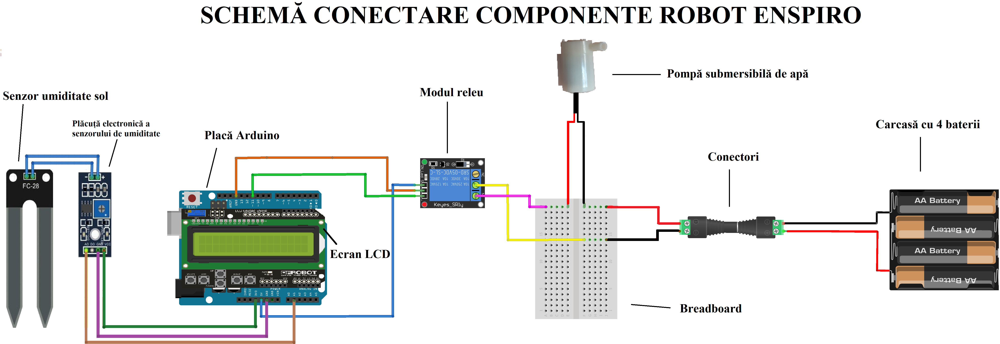

# Robot Enspiro – Smart Irrigation System

This is a simple yet practical Arduino-based automation project. It monitors soil moisture and automatically activates a water pump when the soil is dry, displaying all data on an LCD screen.

## Components Used

- Arduino UNO
- FC-28 Soil Moisture Sensor
- 1-Channel Relay Module
- Submersible Water Pump (5V/6V)
- 4xAA Battery Holder (6V power supply)
- 16x2 LCD Display (standard connection, no I2C)
- Breadboard and jumper wires

## Functionality

- The soil moisture sensor reads the current moisture level of the soil.
- If the value drops below a set threshold (e.g., 450), the relay triggers the water pump for 2 seconds.
- Real-time moisture data is displayed on the LCD.
- The LCD also indicates when watering is triggered.

## Wiring Diagram

> The image shows how all components are connected: the sensor, LCD, relay module, and the pump powered by a separate battery source.

## Source Code

The full Arduino code is in [`program.ino`](program.ino). You can upload it using the Arduino IDE or simulate it using Tinkercad Circuits.

## How to Run the Project

1. Connect the components following the schematic.
2. Upload the code to your Arduino board.
3. Open the Serial Monitor (9600 baud) for debugging if needed.
4. The system will automatically water the soil when it's too dry!

Created as part of an educational project for learning Arduino and automation. — inspired by [Nextlab.tech](https://www.nextlab.tech/)
